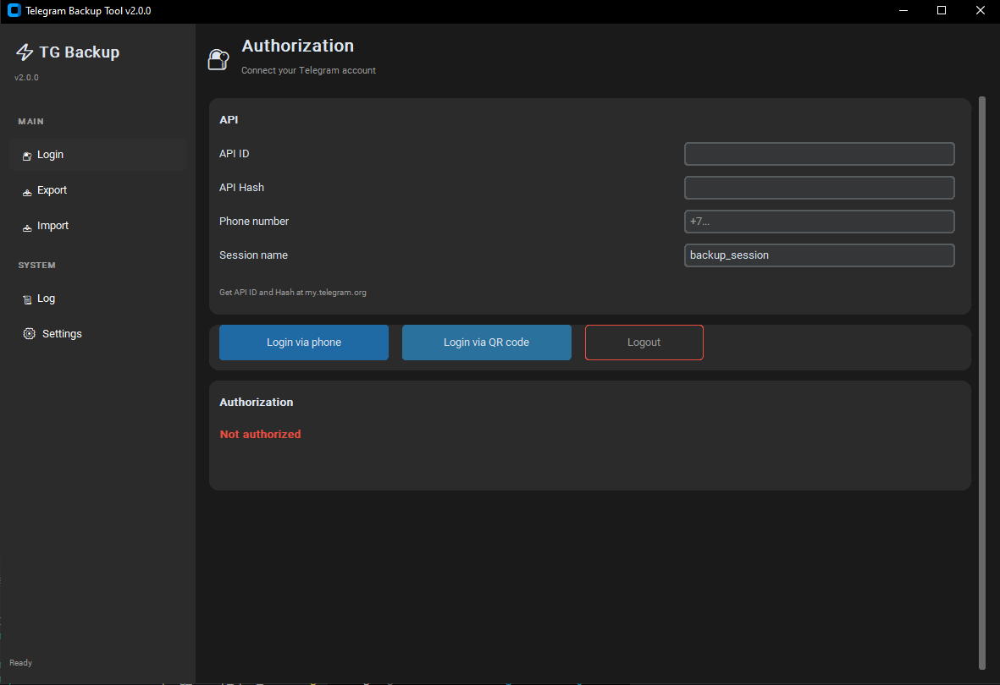
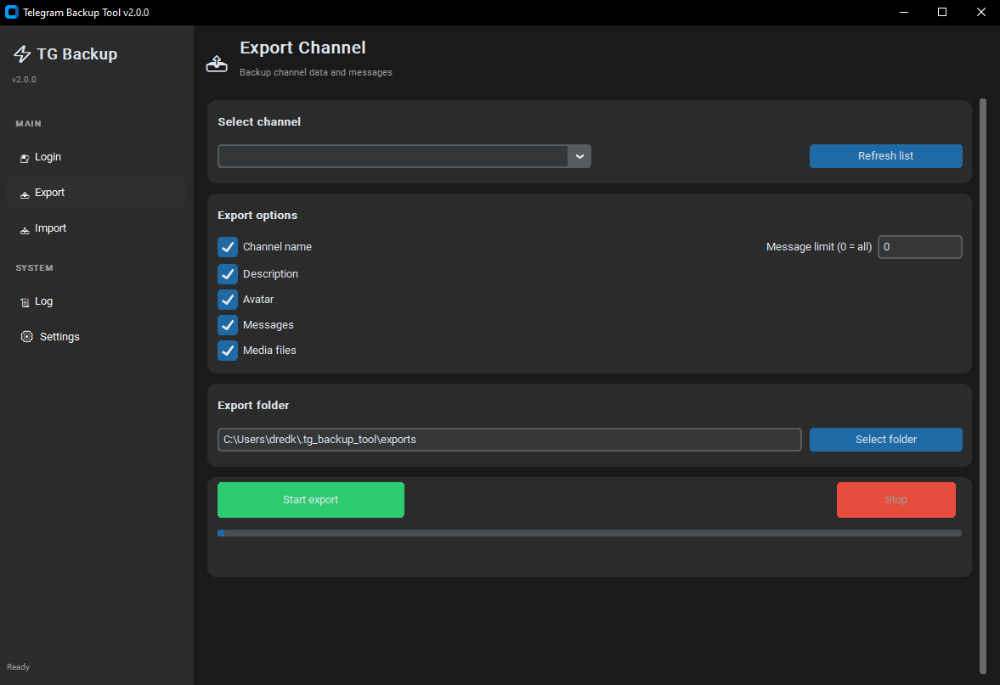
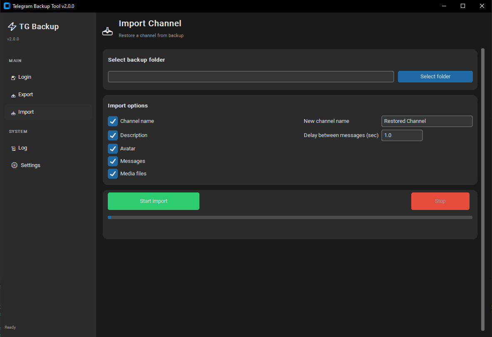
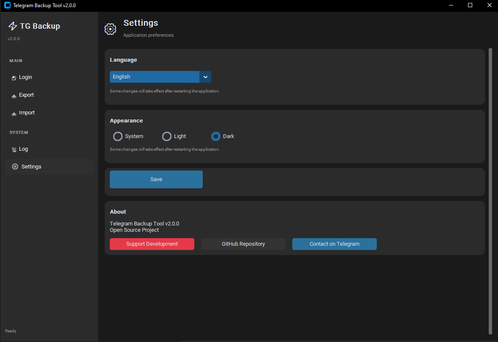

<div align="center">

# 📦 Telegram Backup Tool

**A modern open-source desktop app for backing up and restoring Telegram channels.**

Export messages, media files, avatars and channel info — then restore them to any channel with one click.

[](https://www.python.org/)
[](https://github.com/TomSchimansky/CustomTkinter)
[](https://github.com/LonamiWebs/Telethon)
[](LICENSE)
[]()
[]()

[Features](#-features) • [Installation](#-installation) • [Usage](#-usage) • [FAQ](#-faq) • [Support](#-support-the-project)

</div>

---

## 📖 About

**Telegram Backup Tool** is a free, open-source desktop application that lets you create complete backups of your Telegram channels and restore them later. Perfect for:

- **Archiving** — protecting your channel content from accidental deletion or blocking
- **Migration** — moving channels between accounts
- **Content preservation** — saving rare or valuable media before it disappears
- **Testing** — quickly replicating a channel to experiment with content

The app uses the official [Telegram API](https://my.telegram.org/) through Telethon, so no third-party servers see your data. Everything runs **locally on your machine**.

---

## ✨ Features

- 🔐 **Two login methods** — phone number + SMS code, or QR-code scan
- 📤 **Full channel export** — name, description, avatar, messages, media files
- 📥 **One-click import** — restore a backed-up channel to a new one
- 💬 **Media preservation** — photos, videos, documents, audio
- 🔢 **Message limit** — export only the last N messages if you want
- 🌍 **9 languages** — English, Русский, Español, Português, Deutsch, Français, Türkçe, فارسی, 中文
- 🎨 **Modern UI** — built with CustomTkinter, dark/light themes
- ⚡ **Async core** — the UI never freezes during long operations
- 📜 **Built-in event log** — see exactly what's happening
- 🔒 **100% local** — no data ever leaves your computer
- 🆓 **Free & open source** — no license keys, no subscriptions

---

## 📸 Screenshots

<div align="center">

| Login | Export |
|:---:|:---:|
|  |  |

| Import | Settings |
|:---:|:---:|
|  |  |

</div>

---

## 🚀 Installation

### Option 1: Download prebuilt executable (recommended)

Grab the latest release for your OS from the [Releases page](https://github.com/Igor-Shelloff/tg-backup-tool/releases):

- **Windows** — `TGBackupTool.exe`
- **Linux** — `TGBackupTool` (make it executable with `chmod +x`)
- **macOS** — `TGBackupTool.app`

No Python installation required. Just run it.

### Option 2: Run from source

**Requirements:** Python 3.10 or newer.

```bash
git clone https://github.com/Igor-Shelloff/tg-backup-tool.git
cd tg-backup-tool
python -m venv venv

# Windows
venv\Scripts\activate

# Linux / macOS
source venv/bin/activate

pip install -r requirements.txt
python main.py